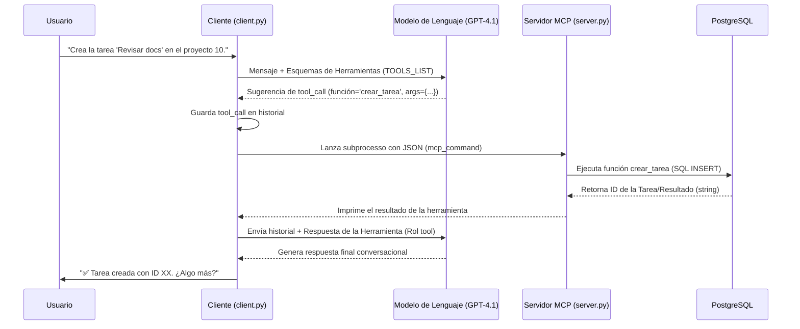

# Arquitectura y Diseño Técnico del ProjectAgent (ATLAS)

| Campo | Valor |
| :--- | :--- |
| **Título del Documento** | **Arquitectura y Diseño Técnico del ProjectAgent (ATLAS)** |
| **ID del Documento** | DSW-ProjectAgent-002 |
| **Versión** | v1.0.0 |
| **Fecha de Creación** | 2025-11-24 |
| **Autor(es)** | Carlos Román |
| **Estado** | Borrador Inicial |

---

## 1. Historial de Revisiones

| Versión | Fecha | Autor | Descripción del Cambio | Base de Cambio (Ticket/ID) |
| :--- | :--- | :--- | :--- | :--- |
| v1.0.0 | 2025-11-24 | Carlos Román | Creación inicial del flujo Cliente/Servidor MCP y modelo de datos. | N/A |

---

## 2. Componentes y Capas de la Arquitectura

ATLAS opera bajo un patrón de **Cliente-Servidor de Proceso de Comandos (MCP)**, diseñado para aislar la lógica de los proyectos y la interacción con la base de datos de la capa de inferencia del LLM.

| Componente | Archivos Clave | Responsabilidad Principal |
| :--- | :--- | :--- |
| **Capa 1: Cliente (Inferencia)** | `atlas_client/client.py` | Bucle de Conversación, Llamada a la API del LLM, y Despacho/Ejecución del Servidor MCP. |
| **Capa 2: Servidor MCP** | `atlas_server/server.py` | Recibir la llamada a la función y argumentos (JSON) y ejecutar el código de la herramienta (`tools.py`). |
| **Capa 3: Herramientas (Lógica)** | `atlas_server/tools.py` | Define las funciones CRUD, valida los datos de entrada (Pydantic) y maneja las transacciones de DB. |
| **Capa 4: Persistencia** | `atlas_server/db_connector.py` | Gestión de la conexión a **PostgreSQL** y reintentos. |

---

## 3. Diagrama de Flujo de la Llamada a Herramienta (Tool-Calling Flow)

Este diagrama ilustra el flujo crítico de datos, desde que el usuario introduce un comando hasta que se ejecuta la acción en la base de datos.

El paso clave es que el Cliente ejecuta el Servidor MCP (server.py) como un subproceso para gestionar la llamada a la herramienta de forma segura y controlada.

---

## 4. Detalle de la Comunicación entre Capas

### 4.1. Cliente ↔ Servidor MCP

* Protocolo: Comunicación estándar de Subproceso (subprocess.run).
* Entrada (Input): El Cliente envía el comando estructurado (Nombre de la Función y Argumentos) al MCP a través de STDIN (entrada estándar) en formato JSON.
* Salida (Output): El Servidor MCP devuelve la respuesta o el error de la función a través de STDOUT (salida estándar), que es capturado por el Cliente.

### 4.2. Validación de Datos (Pydantic)

* Todas las herramientas definidas en tools.py utilizan Pydantic para definir su esquema de entrada.
* El Cliente (client.py) lee este esquema (func.input_schema) para exponerlo al LLM, asegurando que el LLM genera llamadas a funciones con el formato de datos correcto.
* El Servidor MCP espera que la validación del esquema haya sido realizada por el LLM.

---

### 5. Modelo de Datos (Esquema PostgreSQL)

El sistema utiliza un esquema relacional simplificado para la persistencia.

| Entidad (Tabla) | Campos Clave | Relaciones y Notas |
| :--- | :--- | :--- |
| projects |  <ul><li>id (PK, SERIAL)</li><li>name (UNIQUE)</li><li>created_at</li></ul> | Almacena los contenedores principales de trabajo. |
| tasks | <ul><li>id (PK, SERIAL)</li><li>project_id (FK)</li><li>description</li><li>status</li></ul>| Almacena las tareas individuales. |
| Relación:	tasks.project_id | REFERENCES projects.id	ON DELETE CASCADE: | Eliminar un proyecto elimina automáticamente todas sus tareas (RF4.2). |

